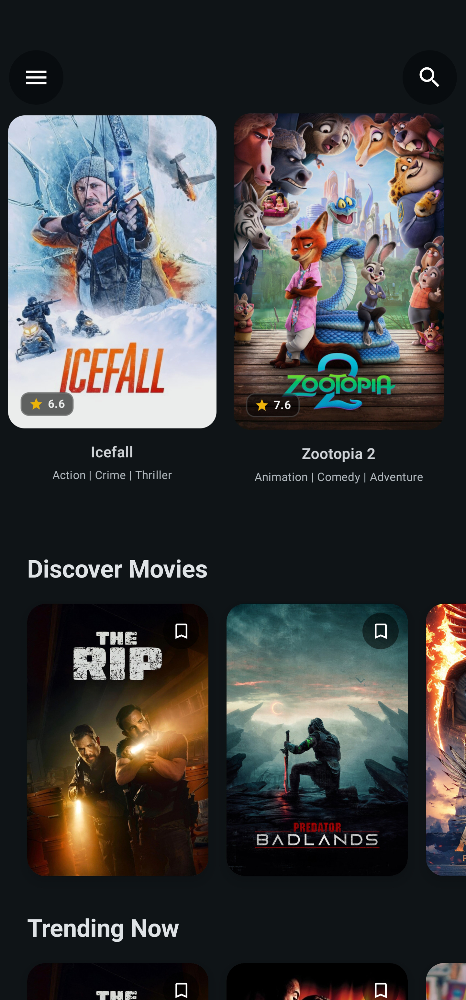
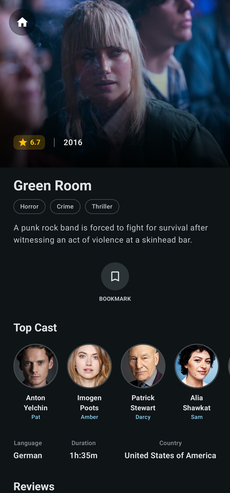

# Moventure

A modern Android application built with Kotlin and Jetpack Compose that allows users to discover movies, search for titles, and manage a personal watchlist. The app consumes data from The Movie Database ([TMDb](www.themoviedb.org)) API to provide movie details, images, and metadata.

## Features

- **Home Feed** – Discover new and trending movies
- **Detailed Movie Information** – View details including synopsis, ratings, and reviews
- **Search** – Search for movies by title
- **Watchlist** – Save movies to a personal watchlist for later viewing
- **Modern UI** – Material Design 3 interface with Jetpack Compose
- **Type-Safe API Calls** – Retrofit with Kotlin Serialization for robust networking

## Project Structure

```
app/src/main/
├── java/com/fr0g/moventure/
│   ├── MainActivity.kt              # App entry point
│   ├── common/                      # Shared utilities & extensions
│   ├── di/                          # Hilt dependency injection modules
│   ├── navigation/                  # Compose navigation setup
│   ├── ui/
│   │   ├── home/                    # Home screen (movie feed)
│   │   ├── detail/                  # Movie detail screen
│   │   ├── search/                  # Search screen
│   │   ├── watchlist/               # Watchlist screen
│   │   ├── components/              # Shared UI components
│   │   ├── theme/                   # Material Design theme & colors
│   │   └── MainScreen.kt            # Main composable container
│   └── utils/                       # Helper functions & utilities
├── res/
└── AndroidManifest.xml
```

## Screenshots

<table>
   <tr>
      <td align="center">
         <strong>Home Screen</strong><br/>
         
      </td>
      <td align="center">
         <strong>Movie Details</strong><br/>
         
      </td>
   </tr>
   <tr>
      <td align="center">
         <strong>Watchlist</strong><br/>
         
      </td>
      <td align="center">
         <strong>Movie Details (Lower Section)</strong><br/>
         
      </td>
   </tr>
</table>

## Getting Started

### Prerequisites
- Android Studio
- JDK 11 or higher
- Android SDK API 35 (minimum API 24)

### Setup & Build

1. **Clone the repository**
   ```bash
   git clone https://github.com/fr0g1299/Moventure-kotlin
   cd Moventure-kotlin
   ```

2. **Open in Android Studio**
   - File → Open → Select project directory

3. **Obtain TMDb API Key**
    - Register for an API key at www.themoviedb.org and follow their instructions to obtain a developer API key.
    - Add your TMDb key to the project's `local.properties` file in the project root (this file is not committed to version control):
       ```properties
       apiKey=tmdb_api_key
       ```

4. **Run the App**
   - Select an emulator or connected device and click Run

## Dependencies

Core dependencies include:
- **androidx.core:core-ktx** – Kotlin extensions for Android Framework
- **androidx.compose*** – Jetpack Compose UI framework
- **androidx.lifecycle*** – Lifecycle-aware components
- **androidx.room*** – Local SQLite database
- **com.squareup.retrofit2** – Type-safe HTTP client
- **io.coil-kt.coil3** – Image loading & caching
- **com.google.dagger.hilt** – Dependency injection framework
- **org.jetbrains.kotlinx:kotlinx-serialization-json** – JSON serialization

See [gradle/libs.versions.toml](gradle/libs.versions.toml) for the complete version catalog.

## Architecture

The app follows **MVVM (Model-View-ViewModel)** architecture with:
- **Repository Pattern** – Abstract data sources (API, local DB)
- **Hilt DI** – Automatic dependency injection across the app
- **Compose State Management** – Reactive UI with ViewModel state
- **Room Database** – Local caching

## License

See [LICENSE](LICENSE) file for details.
